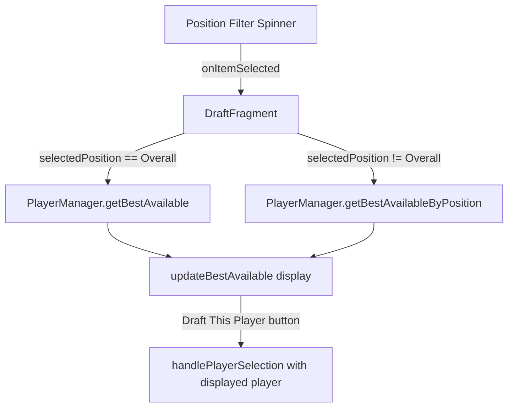

# Design Document: Best Available Position Filter

## Overview

This feature adds a position filter Spinner to the Best Available card in `DraftFragment`, enabling users to filter the best available player by position (QB, RB, WR, TE, K, DST) or view the overall best available. The implementation touches three layers: the XML layout (new Spinner widget), the `PlayerManager` (new filtered lookup method), and `DraftFragment` (Spinner wiring, state tracking, and updated draft logic).

The design keeps changes minimal by adding a single new method to `PlayerManager` and a Spinner + listener in `DraftFragment`. No new classes or data models are needed.

## Architecture

The feature follows the existing architecture pattern where `DraftFragment` delegates data operations to `PlayerManager` via `MainActivity`.



Data flow:
1. User selects a position from the Spinner
2. `DraftFragment` stores the selected position string in a field (`selectedPositionFilter`)
3. `updateBestAvailable()` reads `selectedPositionFilter` and calls the appropriate `PlayerManager` method
4. The result (or null) drives the Best Available display and Draft button state
5. `draftBestAvailablePlayer()` uses the same filter to resolve the currently displayed player

## Components and Interfaces

### PlayerManager — New Method

```java
/**
 * Get the best available player at a specific position.
 * Returns the undrafted player with the lowest rank whose position matches.
 *
 * @param players  List of players to search
 * @param position Position code to filter by (e.g. "QB", "RB")
 * @return The best available player at that position, or null if none available
 */
public Player getBestAvailableByPosition(List<Player> players, String position)
```

This method mirrors `getBestAvailable()` but adds a `position.equals(player.getPosition())` check in the loop. It returns `null` when no undrafted players match.

### DraftFragment — Changes

| Change | Description |
|--------|-------------|
| New field: `Spinner spinnerPositionFilter` | Reference to the Spinner widget |
| New field: `String selectedPositionFilter = "Overall"` | Tracks current filter selection |
| `initializeViews()` | Add Spinner lookup, populate adapter with `{"Overall","QB","RB","WR","TE","K","DST"}`, attach `OnItemSelectedListener` |
| `updateBestAvailable()` | Branch on `selectedPositionFilter`: if "Overall" call `getBestAvailable()`, else call `getBestAvailableByPosition()` |
| `draftBestAvailablePlayer()` | Same branching logic so the drafted player matches what's displayed |
| `resetDraft()` | Reset `selectedPositionFilter` to "Overall" and set Spinner selection to index 0 |

### Layout — `fragment_draft.xml`

A `Spinner` is added inside the Best Available card, between the "Best Available" title `TextView` and the player info `LinearLayout`. It uses an `ArrayAdapter` with `android.R.layout.simple_spinner_item` / `simple_spinner_dropdown_item`.

```xml
<Spinner
    android:id="@+id/spinner_position_filter"
    android:layout_width="match_parent"
    android:layout_height="wrap_content"
    android:layout_marginBottom="8dp"
    android:contentDescription="Filter best available by position" />
```

## Data Models

No new data models are required. The existing `Player` model already has a `String position` field with values like "QB", "RB", "WR", "TE", "K", "DST". The filter operates on these existing position strings.

The Spinner options are a static `String[]`:
```java
private static final String[] POSITION_FILTER_OPTIONS = 
    {"Overall", "QB", "RB", "WR", "TE", "K", "DST"};
```

## Correctness Properties

*A property is a characteristic or behavior that should hold true across all valid executions of a system — essentially, a formal statement about what the system should do. Properties serve as the bridge between human-readable specifications and machine-verifiable correctness guarantees.*

### Property 1: Filtered best available returns the correct player

*For any* list of players (with varying positions, ranks, and drafted statuses) and *for any* position filter value (including "Overall"), `getBestAvailableByPosition` shall return the undrafted player with the lowest rank whose position matches the filter — or null if no such player exists. When the filter is "Overall", the result must equal `getBestAvailable` (lowest rank among all undrafted players).

**Validates: Requirements 2.1, 2.2, 2.4**

### Property 2: Filter selection persists across draft actions

*For any* position filter selection and *for any* sequence of draft actions (drafting a player then triggering UI refresh), the `selectedPositionFilter` value shall remain unchanged from its pre-draft value.

**Validates: Requirements 4.1**

### Property 3: Draft action targets the filtered best available player

*For any* list of players and *for any* position filter value, when the "Draft This Player" action is invoked, the player that gets drafted shall be identical to the player returned by the filtered best available lookup for the current filter value.

**Validates: Requirements 5.1**

## Error Handling

| Scenario | Handling |
|----------|----------|
| No undrafted players match selected position | `getBestAvailableByPosition` returns `null`; UI shows "No players available", disables Draft button, hides injury/stats views |
| Null or empty player list passed to `getBestAvailableByPosition` | Returns `null` (same pattern as existing `getBestAvailable`) |
| Invalid position string (not in the known set) | `getBestAvailableByPosition` simply finds no matches and returns `null` — no crash |
| Spinner selection during draft completion | Draft button is already disabled when draft is complete; filter still works for viewing |
| `null` position on a Player object | `String.equals()` called on the filter string (non-null), so `null` player positions are safely skipped |

## Testing Strategy

### Property-Based Testing

Use `junit-quickcheck` (already in project dependencies) with `@Property(trials = 100)` annotations.

Each property test generates random player lists with random positions, ranks, and drafted states, then asserts the property holds.

| Property | Test Description | Tag |
|----------|-----------------|-----|
| Property 1 | Generate random player lists and random position filters; verify returned player is the lowest-rank undrafted match | `Feature: best-available-position-filter, Property 1: Filtered best available returns the correct player` |
| Property 2 | Generate random filter selections and simulate draft actions; verify filter value is unchanged after each action | `Feature: best-available-position-filter, Property 2: Filter selection persists across draft actions` |
| Property 3 | Generate random player lists and filters; verify the player drafted by the button matches the filtered lookup result | `Feature: best-available-position-filter, Property 3: Draft action targets the filtered best available player` |

### Unit Testing

Focused examples and edge cases using JUnit 4 `@Test`:

- Spinner contains exactly 7 items in correct order (Req 1.2)
- Default selection is "Overall" on init (Req 1.3)
- Content description is set on Spinner (Req 1.4)
- Empty position: all QBs drafted, filter by QB → returns null (Req 3.1, 3.2, 3.3)
- Reset draft resets filter to "Overall" (Req 4.3)
- `getBestAvailableByPosition` with null list returns null
- `getBestAvailableByPosition` with empty list returns null
- `getBestAvailableByPosition` with all players drafted returns null

### Test Configuration

- Property-based tests: minimum 100 trials per property (`@Property(trials = 100)`)
- Each property test tagged with a comment referencing the design property
- Test file: `app/src/test/java/com/fantasydraft/picker/managers/PlayerManagerFilterTest.java` for PlayerManager property + unit tests
- UI-related unit tests can be added to an instrumented test if needed, but the core filtering logic is testable without Android framework dependencies
