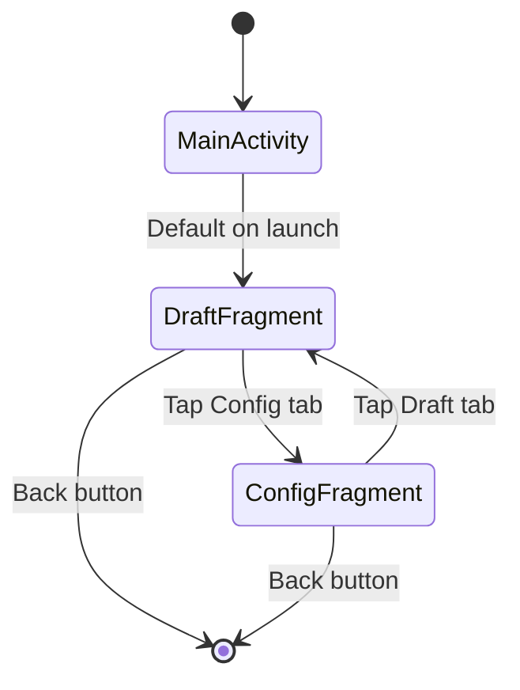
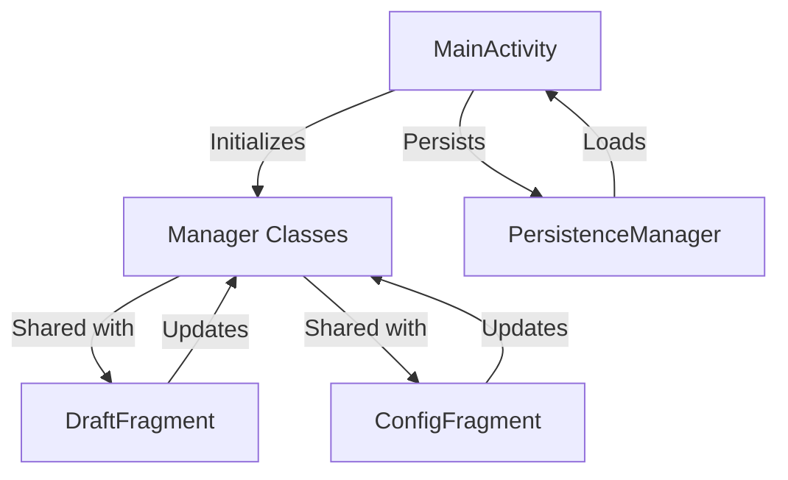

# Design Document: Bottom Navigation Tabs

## Overview

This design transforms the Fantasy Draft Picker app from a multi-activity architecture to a single-activity architecture with fragments and bottom navigation. The current implementation uses MainActivity for the draft screen and ConfigActivity for configuration, requiring explicit navigation between activities. The new design uses a single MainActivity that hosts two fragments (DraftFragment and ConfigFragment) with a BottomNavigationView for seamless tab switching.

### Key Design Decisions

1. **Single Activity Architecture**: Modern Android best practice for better state management and smoother transitions
2. **Fragment-Based UI**: Allows independent lifecycle management and easier state preservation
3. **Shared Manager Pattern**: Manager instances (DraftManager, PlayerManager, TeamManager, DraftCoordinator) are initialized once in MainActivity and accessed by fragments through the activity
4. **Material Design Bottom Navigation**: Standard 56dp height with icons and labels for clear navigation
5. **State Preservation**: Fragments preserve their state during tab switches, and MainActivity handles persistence

## Architecture

### Component Hierarchy

```
MainActivity (Single Activity)
├── BottomNavigationView (2 tabs)
├── FragmentContainerView (content area)
│   ├── DraftFragment (Draft tab content)
│   │   ├── Draft board UI
│   │   ├── Current pick display
│   │   ├── Best available player
│   │   ├── Recent picks
│   │   └── Action buttons
│   └── ConfigFragment (Config tab content)
│       ├── League settings
│       ├── Team configuration
│       └── Save button
└── Manager Classes (shared)
    ├── DraftManager
    ├── PlayerManager
    ├── TeamManager
    ├── DraftCoordinator
    └── PersistenceManager
```

### Navigation Flow



### Data Flow



## Components and Interfaces

### 1. MainActivity (Refactored)

**Purpose**: Host activity that manages fragments, bottom navigation, and shared manager instances.

**Responsibilities**:
- Initialize and manage manager class instances
- Handle bottom navigation tab selection
- Manage fragment transactions
- Persist draft state on pause/stop
- Load draft state on create/resume

**Key Methods**:

```java
public class MainActivity extends AppCompatActivity {
    // Manager instances (shared with fragments)
    private DraftManager draftManager;
    private PlayerManager playerManager;
    private TeamManager teamManager;
    private DraftCoordinator draftCoordinator;
    private PersistenceManager persistenceManager;
    
    // UI components
    private BottomNavigationView bottomNavigation;
    private FragmentContainerView fragmentContainer;
    
    // State
    private DraftState currentState;
    private DraftConfig currentConfig;
    private List<Team> teams;
    private List<Pick> pickHistory;
    
    @Override
    protected void onCreate(Bundle savedInstanceState) {
        // Initialize managers
        // Load draft state
        // Set up bottom navigation
        // Display default fragment (DraftFragment)
    }
    
    private void setupBottomNavigation() {
        // Set up tab selection listener
        // Handle fragment switching
    }
    
    private void showFragment(Fragment fragment) {
        // Perform fragment transaction
        // Replace current fragment
    }
    
    public DraftManager getDraftManager() { return draftManager; }
    public PlayerManager getPlayerManager() { return playerManager; }
    public TeamManager getTeamManager() { return teamManager; }
    public DraftCoordinator getDraftCoordinator() { return draftCoordinator; }
    public PersistenceManager getPersistenceManager() { return persistenceManager; }
    
    public DraftState getCurrentState() { return currentState; }
    public void setCurrentState(DraftState state) { this.currentState = state; }
    public DraftConfig getCurrentConfig() { return currentConfig; }
    public void setCurrentConfig(DraftConfig config) { this.currentConfig = config; }
    public List<Team> getTeams() { return teams; }
    public void setTeams(List<Team> teams) { this.teams = teams; }
    public List<Pick> getPickHistory() { return pickHistory; }
    
    @Override
    protected void onPause() {
        // Save draft state
    }
    
    @Override
    public void onBackPressed() {
        // Exit app (don't navigate between tabs)
    }
}
```

### 2. DraftFragment (New)

**Purpose**: Fragment containing the draft board UI (migrated from MainActivity).

**Responsibilities**:
- Display current pick information
- Show best available player
- Display recent picks
- Handle draft actions (make pick, reset, view history, export)
- Update UI when draft state changes

**Key Methods**:

```java
public class DraftFragment extends Fragment {
    // UI components (same as current MainActivity)
    private TextView textOverallPick;
    private TextView textRoundPick;
    private TextView textCurrentTeam;
    private TextView textBestPlayerName;
    private Button buttonMakePick;
    // ... other UI components
    
    // Reference to MainActivity for accessing managers
    private MainActivity mainActivity;
    
    @Override
    public View onCreateView(LayoutInflater inflater, ViewGroup container, Bundle savedInstanceState) {
        // Inflate layout (fragment_draft.xml)
        // Initialize UI components
        // Set up click handlers
    }
    
    @Override
    public void onResume() {
        // Get managers from MainActivity
        // Refresh UI with current data
    }
    
    private void updateUI() {
        // Update all UI components with current draft state
        // Same logic as current MainActivity.updateUI()
    }
    
    private void showPlayerSelectionDialog() {
        // Show player selection dialog
        // Handle player selection
    }
    
    private void handlePlayerSelection(Player player) {
        // Draft player
        // Update managers
        // Notify MainActivity to save state
        // Refresh UI
    }
    
    private void resetDraft() {
        // Reset draft through coordinator
        // Notify MainActivity to save state
        // Refresh UI
    }
    
    // ... other methods from current MainActivity
}
```

### 3. ConfigFragment (New)

**Purpose**: Fragment containing the configuration UI (migrated from ConfigActivity).

**Responsibilities**:
- Display league settings (name, team count, rounds, flow type)
- Show team list with editable names and draft positions
- Validate configuration changes
- Save configuration updates
- Disable certain controls during active draft

**Key Methods**:

```java
public class ConfigFragment extends Fragment {
    // UI components (same as current ConfigActivity)
    private TextInputEditText inputLeagueName;
    private NumberPicker numberPickerTeamCount;
    private NumberPicker numberPickerRounds;
    private Spinner spinnerDraftFlow;
    private RecyclerView recyclerTeams;
    private Button buttonSaveConfig;
    
    // Reference to MainActivity for accessing managers
    private MainActivity mainActivity;
    
    // Adapter
    private TeamConfigAdapter teamAdapter;
    
    @Override
    public View onCreateView(LayoutInflater inflater, ViewGroup container, Bundle savedInstanceState) {
        // Inflate layout (fragment_config.xml)
        // Initialize UI components
        // Set up adapters and listeners
    }
    
    @Override
    public void onResume() {
        // Get managers and state from MainActivity
        // Load current configuration into UI
        // Update control states based on draft progress
    }
    
    private void setupNumberPickers() {
        // Configure team count and rounds pickers
        // Disable if draft has picks
    }
    
    private void saveConfiguration() {
        // Validate team names
        // Validate draft order
        // Update MainActivity state
        // Notify MainActivity to save state
        // Show confirmation
    }
    
    private void updateControlStates() {
        // Enable/disable controls based on draft progress
        // Show message if controls are disabled
    }
    
    // ... other methods from current ConfigActivity
}
```

### 4. Fragment Communication Pattern

Fragments communicate with MainActivity through direct method calls:

```java
// In Fragment:
MainActivity mainActivity = (MainActivity) getActivity();
if (mainActivity != null) {
    DraftManager draftManager = mainActivity.getDraftManager();
    // Use manager...
    
    // After making changes:
    mainActivity.saveDraftState();
}
```

## Data Models

No changes to existing data models. The following models remain unchanged:

- **DraftState**: Current round, pick number, completion status
- **DraftConfig**: Flow type, number of rounds, keeper league flag, league name
- **Team**: Team ID, name, draft position, roster
- **Player**: Player details, draft status
- **Pick**: Pick number, round, team, player, timestamp
- **DraftSnapshot**: Complete draft state for persistence

## Correctness Properties

*A property is a characteristic or behavior that should hold true across all valid executions of a system—essentially, a formal statement about what the system should do. Properties serve as the bridge between human-readable specifications and machine-verifiable correctness guarantees.*


### Property 1: Tab selection displays correct fragment
*For any* tab selection (Draft or Config), the MainActivity should display the corresponding fragment (DraftFragment for Draft tab, ConfigFragment for Config tab)
**Validates: Requirements 2.1, 3.1, 4.1, 4.2**

### Property 2: Bottom navigation remains visible
*For any* screen state, the BottomNavigationView should have visibility set to VISIBLE and be positioned at the bottom of the screen
**Validates: Requirements 1.2**

### Property 3: Active tab is highlighted
*For any* tab selection, the selected tab should have the highlighted/selected state in the BottomNavigationView
**Validates: Requirements 1.3**

### Property 4: Draft screen displays current pick information
*For any* draft state, the DraftFragment should display the correct overall pick number, round number, pick in round, and current team name
**Validates: Requirements 2.2**

### Property 5: Best available player is displayed correctly
*For any* draft state with available players, the DraftFragment should display the best available player's name, position, and rank
**Validates: Requirements 2.3**

### Property 6: Recent picks are displayed correctly
*For any* draft state with pick history, the DraftFragment should display the three most recent picks with correct player details and team information
**Validates: Requirements 2.4**

### Property 7: UI updates after pick
*For any* valid player selection and draft, after making the pick, the DraftFragment UI should reflect the updated draft state including new current pick, updated best available, and new recent pick
**Validates: Requirements 2.7**

### Property 8: Config screen displays all teams
*For any* team configuration, the ConfigFragment should display all teams in the RecyclerView with their names and draft positions
**Validates: Requirements 3.3**

### Property 9: Team name validation rejects invalid names
*For any* set of team names containing duplicates or empty strings, the ConfigFragment validation should reject the save operation and display an error message
**Validates: Requirements 3.5**

### Property 10: Draft order validation rejects incomplete sequences
*For any* draft order that is not a complete sequence from 1 to N (where N is team count), the ConfigFragment validation should reject the save operation and display an error message
**Validates: Requirements 3.6**

### Property 11: Configuration changes are persisted
*For any* valid configuration change (league name, team names, flow type, rounds, keeper mode), after saving, the configuration should be persisted and available when the app is restarted
**Validates: Requirements 3.7**

### Property 12: Unsaved UI changes are preserved during tab switches
*For any* unsaved changes in ConfigFragment input fields, switching to Draft tab and back to Config tab should preserve those unsaved values in the UI
**Validates: Requirements 3.8**

### Property 13: Fragment state is preserved during tab switches
*For any* fragment state (scroll position, expanded/collapsed sections, input values), switching to another tab and back should preserve that state
**Validates: Requirements 4.3**

### Property 14: Data consistency across fragments
*For any* state change in one fragment (config update in ConfigFragment or pick made in DraftFragment), switching to the other fragment should reflect the updated state
**Validates: Requirements 5.3, 5.4**

### Property 15: Structural config controls disabled during active draft
*For any* draft state with at least one pick, the ConfigFragment should disable the team count picker, rounds picker, and flow type spinner, while keeping team name fields and league name field enabled
**Validates: Requirements 6.1, 6.2, 6.3, 6.5**

### Property 16: Disabled controls show explanatory message
*For any* draft state with at least one pick, the ConfigFragment should display a message indicating that structural settings cannot be changed during an active draft
**Validates: Requirements 6.4**

### Property 17: State persisted on lifecycle events
*For any* lifecycle event (tab switch, app pause, app stop), the MainActivity should save the current draft state, configuration, teams, and pick history to persistence
**Validates: Requirements 5.6, 8.1, 8.2**

### Property 18: State loaded on app resume
*For any* app resume or restart, the MainActivity should load the previously saved draft state, configuration, teams, and pick history from persistence
**Validates: Requirements 8.3**

### Property 19: Persistence failure handled gracefully
*For any* persistence operation failure, the MainActivity should display an error message to the user and continue operating without saving (not crash)
**Validates: Requirements 8.4**

### Property 20: Complete snapshot persisted
*For any* persistence save operation, the saved snapshot should include all teams, all players with draft status, complete pick history, draft state, and draft configuration
**Validates: Requirements 8.5**

### Property 21: Content area not obscured by navigation
*For any* screen state, the content area (fragment container) should not overlap with the BottomNavigationView, and content should be scrollable if it exceeds available height
**Validates: Requirements 9.1, 9.2, 9.3, 9.5**

### Property 22: Fragment UI refreshed on resume
*For any* fragment resume event, the fragment should refresh its UI components with the current data from the shared Manager_Classes instances
**Validates: Requirements 11.2**

## Error Handling

### Fragment Communication Errors

**Scenario**: Fragment attempts to access MainActivity but activity is null or not of correct type

**Handling**:
- Check for null activity before accessing managers
- Use instanceof to verify activity type
- Log error and show user-friendly message if managers unavailable
- Gracefully degrade functionality (e.g., disable buttons if managers unavailable)

```java
private MainActivity getMainActivity() {
    Activity activity = getActivity();
    if (activity instanceof MainActivity) {
        return (MainActivity) activity;
    }
    Log.e(TAG, "Activity is not MainActivity");
    return null;
}
```

### Persistence Errors

**Scenario**: Persistence operations fail due to storage issues, corrupted data, or database errors

**Handling**:
- Catch PersistenceException in MainActivity
- Display error dialog with user-friendly message
- Offer options: continue without saving, reset draft, or retry
- Disable persistence if errors persist
- Log detailed error information for debugging

### Validation Errors

**Scenario**: User attempts to save invalid configuration (duplicate team names, incomplete draft order)

**Handling**:
- Validate before saving
- Show specific error message indicating the problem
- Highlight problematic fields in UI
- Prevent save operation until validation passes
- Preserve user input so they can correct errors

### State Inconsistency Errors

**Scenario**: Draft state becomes inconsistent (e.g., pick count doesn't match draft state)

**Handling**:
- Validate state consistency on load
- Recalculate derived values from authoritative sources (pick history)
- Offer to reset draft if state cannot be recovered
- Log inconsistency details for debugging

## Testing Strategy

### Dual Testing Approach

This feature requires both unit tests and property-based tests for comprehensive coverage:

**Unit Tests** focus on:
- Specific UI element presence (buttons, tabs, icons exist)
- Specific examples (default tab on launch, back button behavior)
- Edge cases (empty pick history, draft completion state)
- Integration points (fragment-activity communication)
- Error conditions (null activity, persistence failures)

**Property-Based Tests** focus on:
- Universal properties across all inputs (tab selection always shows correct fragment)
- State preservation across lifecycle events (any state preserved during tab switch)
- Data consistency (any config change reflected in both fragments)
- Validation logic (any invalid team names rejected)
- UI updates (any pick updates UI correctly)

### Property-Based Testing Configuration

**Library**: JUnit-QuickCheck (already included in build.gradle)

**Configuration**:
- Minimum 100 iterations per property test
- Each test tagged with feature name and property number
- Tag format: `// Feature: bottom-navigation-tabs, Property N: [property text]`

**Example Property Test**:

```java
@RunWith(JUnitQuickCheck.class)
public class BottomNavigationPropertyTests {
    
    // Feature: bottom-navigation-tabs, Property 1: Tab selection displays correct fragment
    @Property(trials = 100)
    public void tabSelectionDisplaysCorrectFragment(@InRange(min = "0", max = "1") int tabIndex) {
        // Setup: Create MainActivity with fragments
        // Action: Select tab by index (0 = Draft, 1 = Config)
        // Assert: Correct fragment is displayed
    }
    
    // Feature: bottom-navigation-tabs, Property 9: Team name validation rejects invalid names
    @Property(trials = 100)
    public void teamNameValidationRejectsInvalidNames(List<String> teamNames) {
        // Filter to create invalid cases (duplicates or empty)
        // Action: Attempt to save configuration
        // Assert: Validation fails and error shown
    }
}
```

### Unit Test Examples

```java
public class BottomNavigationUnitTests {
    
    @Test
    public void bottomNavigationHasTwoTabs() {
        // Validates: Requirements 1.1
        // Assert: BottomNavigationView has exactly 2 menu items
    }
    
    @Test
    public void draftTabIsDefaultOnLaunch() {
        // Validates: Requirements 4.5
        // Assert: Draft tab selected and DraftFragment displayed on launch
    }
    
    @Test
    public void editConfigButtonNotPresent() {
        // Validates: Requirements 7.1
        // Assert: DraftFragment layout does not contain Edit Config button
    }
    
    @Test
    public void backButtonExitsApp() {
        // Validates: Requirements 10.1
        // Assert: Back button press calls finish() on MainActivity
    }
}
```

### Integration Testing

**Fragment Lifecycle Tests**:
- Test fragment creation, resume, pause, destroy sequence
- Verify UI initialization and cleanup
- Test state preservation across configuration changes

**Manager Sharing Tests**:
- Verify fragments receive same manager instances from MainActivity
- Test that changes through one fragment's managers are visible to other fragment
- Verify manager lifecycle (created once, shared, not leaked)

**Navigation Tests**:
- Test tab switching in various sequences
- Verify fragment transactions complete successfully
- Test back button behavior from each tab

**Persistence Integration Tests**:
- Test save/load cycle with real PersistenceManager
- Verify complete snapshot is saved and restored
- Test error recovery scenarios

### UI Testing (Espresso)

**Navigation Flow Tests**:
- Launch app → verify Draft tab selected
- Tap Config tab → verify ConfigFragment displayed
- Tap Draft tab → verify DraftFragment displayed
- Press back → verify app exits

**State Preservation Tests**:
- Make pick in Draft → switch to Config → verify pick count updated
- Change config → switch to Draft → verify config displayed
- Enter text in Config → switch tabs → return → verify text preserved

**Validation Tests**:
- Enter duplicate team names → tap save → verify error shown
- Enter invalid draft order → tap save → verify error shown

### Test Coverage Goals

- **Unit Tests**: 80%+ code coverage for fragment and activity classes
- **Property Tests**: All 22 correctness properties implemented
- **Integration Tests**: All fragment-activity interactions covered
- **UI Tests**: All user workflows covered (navigation, drafting, configuration)

### Testing Notes

- Mock PersistenceManager for unit tests to avoid file I/O
- Use Robolectric for fragment lifecycle testing without emulator
- Property tests should use custom generators for domain objects (Team, Player, DraftState)
- UI tests should use Espresso idling resources for async operations
- Test on multiple screen sizes to verify layout adaptation
