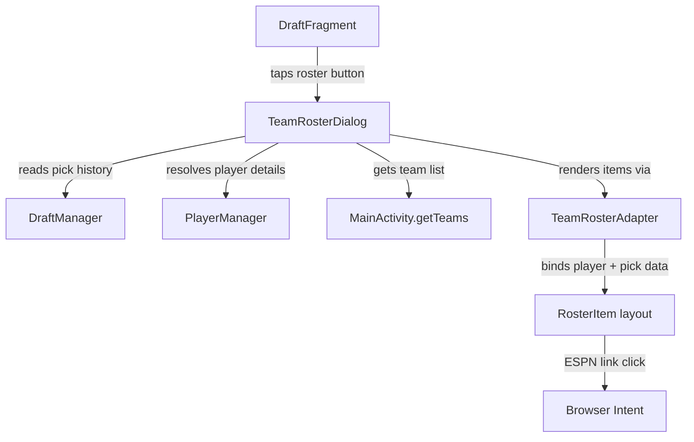
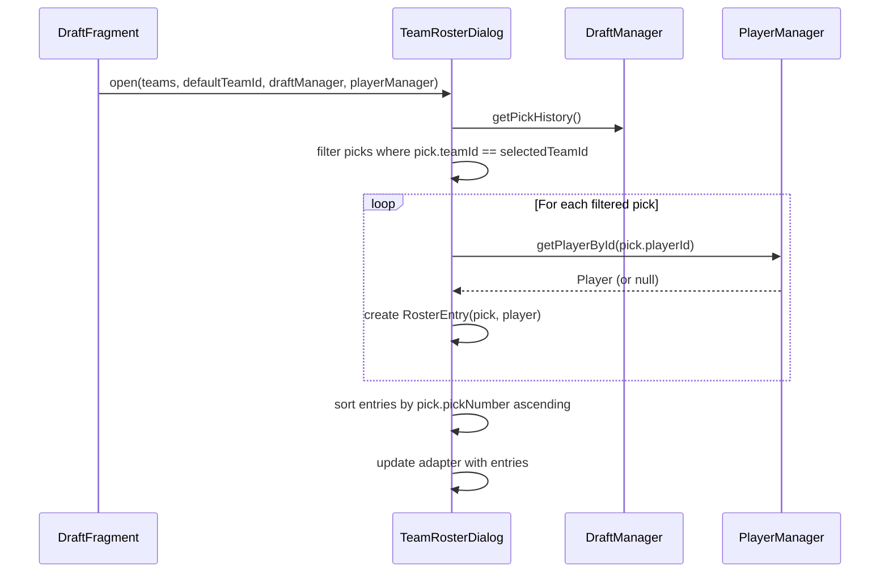

# Design Document: Team Roster Popup

## Overview

The Team Roster Popup feature adds a dialog that displays all players drafted by a selected team during a fantasy draft session. It is accessed via a clickable button next to the "On the clock" team name in `DraftFragment`. The dialog includes a team selector (Spinner) to switch between any team, defaults to the on-the-clock team, and shows a scrollable list of roster items with comprehensive player attributes. Data is sourced from `DraftManager.getPickHistory()` filtered by team ID, with player details resolved via `PlayerManager.getPlayerById()`.

This feature follows the existing dialog pattern established by `PlayerSelectionDialog` — a custom `Dialog` subclass with its own XML layout, a `RecyclerView` for the list, and an adapter for item rendering.

## Architecture

The feature introduces three new components that integrate into the existing architecture:



**Integration points:**
- `DraftFragment` gains a new `ImageButton` next to `textCurrentTeam` and a method `showTeamRosterDialog()` to launch the dialog
- `TeamRosterDialog` receives references to `DraftManager`, `PlayerManager`, and the team list from `MainActivity`
- No changes to existing models (`Player`, `Pick`, `Team`) are required — all needed fields already exist

## Components and Interfaces

### 1. TeamRosterDialog (new)

Custom `Dialog` subclass at `com.fantasydraft.picker.ui.TeamRosterDialog`.

```java
public class TeamRosterDialog extends Dialog {
    
    // Constructor receives all data dependencies
    public TeamRosterDialog(Context context, 
                            List<Team> teams, 
                            String defaultTeamId,
                            DraftManager draftManager, 
                            PlayerManager playerManager);
    
    // Core methods
    private void initializeViews();
    private void setupTeamSpinner();
    private void loadRosterForTeam(String teamId);
    private List<RosterEntry> buildRosterEntries(String teamId);
}
```

**Responsibilities:**
- Display team selector Spinner populated with all teams in draft order
- Filter `pickHistory` by selected team ID
- Resolve each pick's `playerId` to a full `Player` via `PlayerManager.getPlayerById()`
- Pair each `Pick` with its `Player` into a `RosterEntry` for display
- Show empty state when team has no picks
- Dismiss on close button tap

### 2. RosterEntry (new inner class or simple POJO)

A lightweight data holder combining a `Pick` and its resolved `Player`, used by the adapter.

```java
public class RosterEntry {
    private final Pick pick;      // round, pickInRound, pickNumber
    private final Player player;  // may be null if player not found
    
    public RosterEntry(Pick pick, Player player);
    public Pick getPick();
    public Player getPlayer();
}
```

### 3. TeamRosterAdapter (new)

`RecyclerView.Adapter` at `com.fantasydraft.picker.ui.TeamRosterAdapter`.

```java
public class TeamRosterAdapter extends RecyclerView.Adapter<TeamRosterAdapter.ViewHolder> {
    
    public TeamRosterAdapter(List<RosterEntry> entries);
    public void updateEntries(List<RosterEntry> entries);
    
    // ViewHolder binds all player attributes from RosterEntry
    static class ViewHolder extends RecyclerView.ViewHolder {
        // name, position badge, nflTeam, rank, pffRank, positionRank,
        // lastYearStats, injuryStatus, byeWeek, round/pick, ESPN link
    }
}
```

**Rendering rules per Requirement 4:**
- Position badge uses `PositionColors.getColorForPosition()` (existing utility)
- Injury status field hidden when value is null or empty (Req 4.12)
- ESPN link opens browser via Intent using `Player.getEspnUrl()` (existing method)
- Items ordered by `Pick.getPickNumber()` ascending (Req 4.13)
- Unknown player (null from `getPlayerById`) shows placeholder text (Req 6.4)

### 4. DraftFragment modifications

- Add `ImageButton buttonViewRoster` field
- In `initializeViews()`: bind `R.id.button_view_roster`
- In `initializeViews()`: set click listener to call `showTeamRosterDialog()`
- New method `showTeamRosterDialog()` constructs and shows `TeamRosterDialog`
- In `updateCurrentPick()`: show/hide roster button based on draft active state

### 5. Layout files (new)

- `dialog_team_roster.xml` — Dialog layout with title, Spinner, RecyclerView, empty state TextView, close Button
- `item_roster_entry.xml` — Individual roster item layout with all player attribute fields

## Data Models

No new persistent data models are needed. The feature uses existing models:

### Existing models used as-is:
- **Player** — All required display fields already exist: `name`, `position`, `nflTeam`, `rank`, `pffRank`, `positionRank`, `lastYearStats`, `injuryStatus`, `byeWeek`, `espnId`. The `getEspnUrl()` method already constructs the ESPN profile URL.
- **Pick** — Contains `teamId`, `playerId`, `round`, `pickInRound`, `pickNumber` for filtering and display.
- **Team** — Contains `id`, `name`, `draftPosition` for the team selector.

### New transient data holder:
- **RosterEntry** — Pairs a `Pick` with its resolved `Player`. Not persisted. Created on-the-fly when the dialog loads or the team selection changes.

### Data flow:




## Correctness Properties

*A property is a characteristic or behavior that should hold true across all valid executions of a system — essentially, a formal statement about what the system should do. Properties serve as the bridge between human-readable specifications and machine-verifiable correctness guarantees.*

### Property 1: Pick filtering by team returns exactly that team's picks

*For any* list of picks (pick history) and *for any* team ID, filtering the pick history by that team ID should return exactly the picks whose `teamId` matches the selected team ID, and no others.

**Validates: Requirements 2.3, 3.2, 6.1, 6.2**

### Property 2: Team selector contains all teams in draft position order

*For any* list of teams, the team selector entries should contain exactly those teams, and they should be ordered by `draftPosition` in ascending order.

**Validates: Requirements 2.1, 2.5**

### Property 3: Roster entries are ordered by pick number ascending

*For any* list of roster entries built from filtered picks, the entries should be sorted by `pick.getPickNumber()` in ascending order (i.e., for all consecutive pairs, the earlier entry has a smaller or equal pick number).

**Validates: Requirements 4.13**

### Property 4: Roster item contains all required player attributes

*For any* `RosterEntry` with a non-null `Player`, the bound view holder should display: player name, position, nflTeam, rank, pffRank, positionRank, lastYearStats, byeWeek, and round/pick number. Each of these fields from the `Player` and `Pick` objects must appear in the rendered output.

**Validates: Requirements 4.1, 4.2, 4.3, 4.4, 4.5, 4.6, 4.7, 4.9, 4.10**

### Property 5: ESPN URL construction round trip

*For any* non-empty `espnId` string, `Player.getEspnUrl()` should return a URL containing that `espnId`, and the URL should match the pattern `https://www.espn.com/nfl/player/_/id/{espnId}`. For an empty or null `espnId`, `getEspnUrl()` should return null.

**Validates: Requirements 4.11**

### Property 6: Dialog title reflects selected team name

*For any* team selected in the team selector, the dialog title text should contain that team's `name`.

**Validates: Requirements 2.4, 3.1**

## Error Handling

| Scenario | Handling |
|---|---|
| `PlayerManager.getPlayerById()` returns null | Display roster entry with placeholder text "Unknown Player" and show pick round/number only (Req 6.4) |
| Pick history is empty for selected team | Show empty state TextView: "No players drafted yet" and hide RecyclerView (Req 3.3) |
| Injury status is null or empty | Hide the injury status TextView for that roster item (Req 4.12) |
| ESPN ID is null or empty | Hide the ESPN link TextView for that roster item; `Player.getEspnUrl()` already returns null in this case |
| Teams list is empty | Should not occur during active draft; dialog will show empty spinner as defensive measure |
| Dialog opened when no team is on the clock | Button is hidden when draft is not active (Req 1.4), so this path is prevented at the UI level |

## Testing Strategy

### Unit Tests

Unit tests cover specific examples, edge cases, and integration points:

- **Empty roster**: Verify that when a team has zero picks, `buildRosterEntries()` returns an empty list
- **Unknown player placeholder**: Verify that when `getPlayerById()` returns null, the `RosterEntry` has a null player and the adapter shows placeholder text
- **Injury status omission**: Verify that a player with null/empty `injuryStatus` results in the injury field being hidden
- **ESPN link omission**: Verify that a player with null/empty `espnId` results in the ESPN link being hidden
- **Default team selection**: Verify the dialog opens with the on-the-clock team pre-selected in the spinner

### Property-Based Tests

Property-based tests verify universal properties across randomly generated inputs. Use **jqwik** as the property-based testing library for Java/Android.

Each property test must run a minimum of 100 iterations and be tagged with a comment referencing the design property.

- **Feature: team-roster-popup, Property 1: Pick filtering by team returns exactly that team's picks**
  Generate random pick histories with multiple teams, select a random team ID, filter, and assert only matching picks are returned.

- **Feature: team-roster-popup, Property 2: Team selector contains all teams in draft position order**
  Generate random lists of teams with various draft positions, build the spinner data, and assert all teams are present and sorted by draft position.

- **Feature: team-roster-popup, Property 3: Roster entries are ordered by pick number ascending**
  Generate random sets of picks for a team, build roster entries, and assert the resulting list is sorted by pick number.

- **Feature: team-roster-popup, Property 4: Roster item contains all required player attributes**
  Generate random Player and Pick objects, create a RosterEntry, and assert all required fields are present in the bound data.

- **Feature: team-roster-popup, Property 5: ESPN URL construction round trip**
  Generate random non-empty espnId strings and verify `getEspnUrl()` returns the correct URL pattern. Generate null/empty espnIds and verify null is returned.

- **Feature: team-roster-popup, Property 6: Dialog title reflects selected team name**
  Generate random team names, simulate selection, and verify the title contains the team name.
